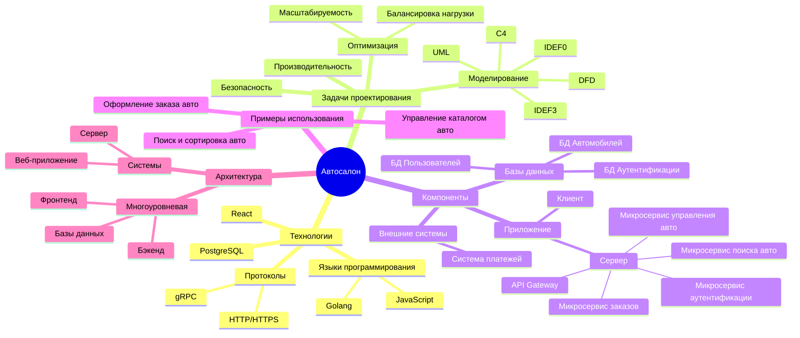
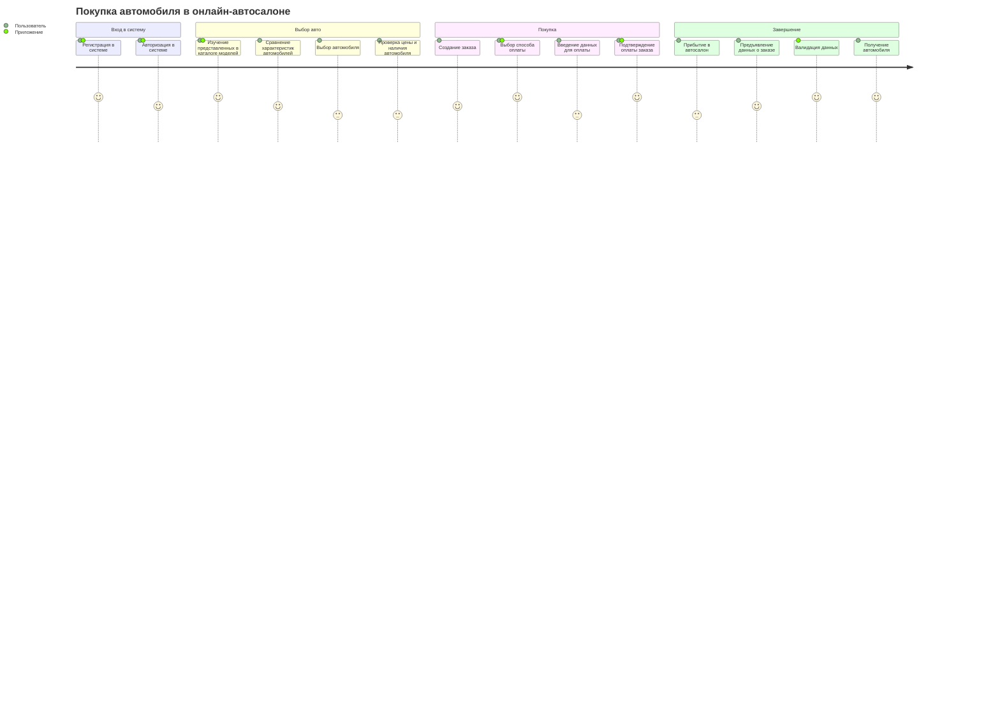
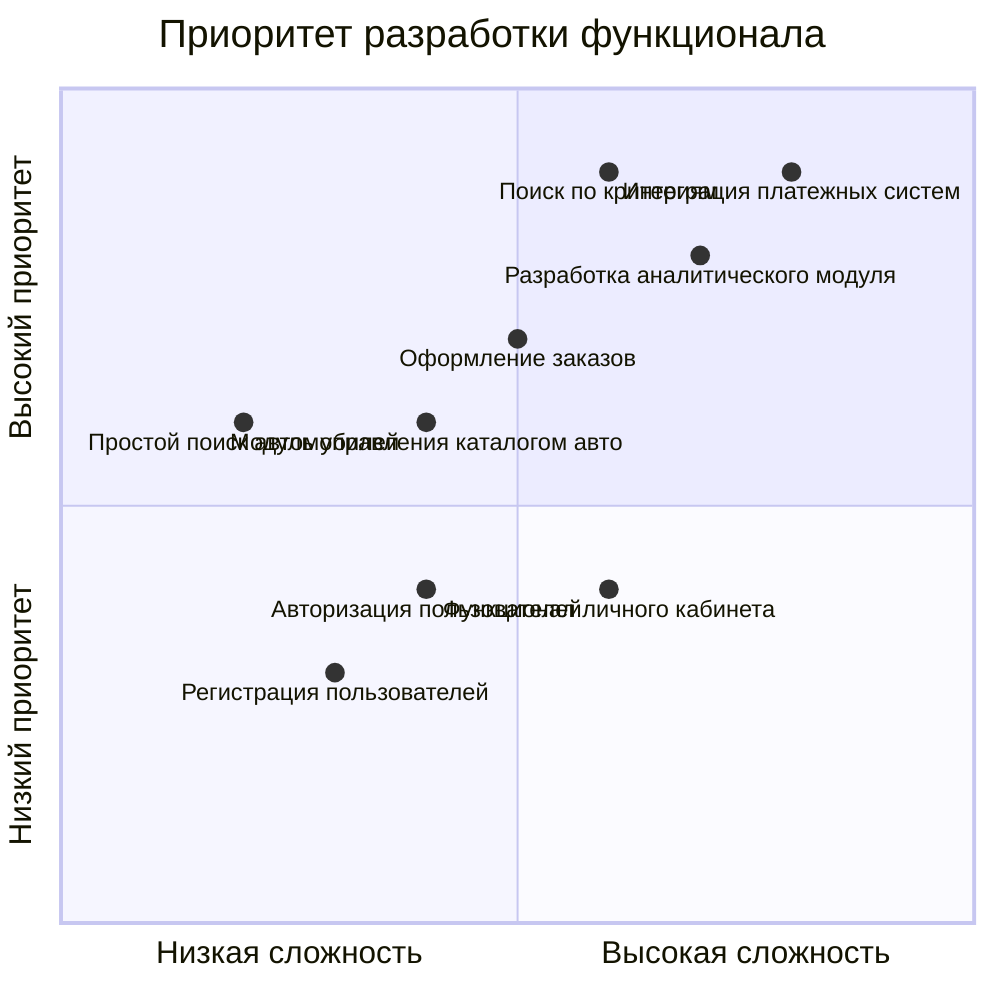
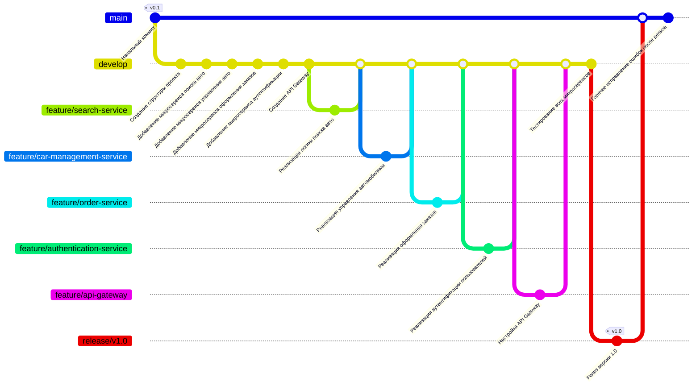

# pract12-repo

## Диаграмма Mindmap для автосалона

```mermaid

mindmap
	root((Автосалон))
		Технологии
			Языки программирования
				Golang
				JavaScript
			React
			PostgreSQL
			Протоколы
				HTTP/HTTPS
				gRPC
		Задачи проектирования
			Производительность
			Безопасность
			Оптимизация
				Балансировка нагрузки
				Масштабируемость
			Моделирование
				С4
				UML
				IDEF0
				DFD
				IDEF3
		Компоненты
			Базы данных
				БД Пользователей
				БД Автомобилей
				БД Аутентификации
			Внешние системы
				Система платежей
			Приложение
				Клиент
				Сервер
					API Gateway
					Микросервис аутентификации
					Микросервис заказов
					Микросервис поиска авто
					Микросервис управления авто
		Примеры использования
			Оформление заказа авто
			Управление каталогом авто
			Поиск и сортировка авто
		Архитектура
			Многоуровневая
				Фронтенд
				Бэкенд
				Базы данных
			Системы
				Веб-приложение
				Сервер
```
## Диаграмма User Journey для автосалона

```mermaid

journey title
Покупка автомобиля в онлайн-автосалоне
section Вход в систему
	Регистрация в системе: 5: Пользователь, Приложение
	Авторизация в системе: 4: Пользователь, Приложение
section Выбор авто
	Изучение представленных в каталоге моделей: 5: Пользователь, Приложение
	Сравнение характеристик автомобилей: 4: Пользователь
	Выбор автомобиля: 3: Пользователь
	Проверка цены и наличия автомобиля: 3: Пользователь
section Покупка
	Создание заказа: 4: Пользователь
	Выбор способа оплаты: 5: Пользователь, Приложение
	Введение данных для оплаты: 3: Пользователь
	Подтверждение оплаты заказа: 5: Пользователь, Приложение
section Завершение
	Прибытие в автосалон: 3: Пользователь
	Предъявление данных о заказе: 4: Пользователь
	Валидация данных: 5: Приложение
	Получение автомобиля: 5: Пользователь
```

## Квадрант-граф

```mermaid

quadrantChart title Приоритет разработки функционала

	x-axis "Низкая сложность" --> "Высокая сложность"
	y-axis "Низкий приоритет" --> "Высокий приоритет"
	
	"Простой поиск автомобилей": [0.2, 0.6]
	"Оформление заказов": [0.5, 0.7]
	"Регистрация пользователей": [0.3, 0.3]
	"Авторизация пользователей": [0.4, 0.4]
	"Поиск по критериям": [0.6, 0.9]
	"Интеграция платежных систем": [0.8, 0.9]
	"Разработка аналитического модуля": [0.7, 0.8]
	"Модуль управления каталогом авто": [0.4, 0.6]
	"Функционал личного кабинета": [0.6, 0.4]

```

## Гит граф

```mermaid

gitGraph
    commit id: "Начальный коммит" tag: "v0.1"

    branch develop
    commit id: "Создание структуры проекта"
    commit id: "Добавление микросервиса поиска авто"
    commit id: "Добавление микросервиса управления авто"
    commit id: "Добавление микросервиса оформления заказов"
    commit id: "Добавление микросервиса аутентификации"
    commit id: "Создание API Gateway"

    branch feature/search-service
    commit id: "Реализация логики поиска авто"
    checkout develop
    merge feature/search-service

    branch feature/car-management-service
    commit id: "Реализация управления автомобилями"
    checkout develop
    merge feature/car-management-service

    branch feature/order-service
    commit id: "Реализация оформления заказов"
    checkout develop
    merge feature/order-service

    branch feature/authentication-service
    commit id: "Реализация аутентификации пользователей"
    checkout develop
    merge feature/authentication-service

    branch feature/api-gateway
    commit id: "Настройка API Gateway"
    checkout develop
    merge feature/api-gateway

    commit id: "Тестирование всех микросервисов"
    
    branch release/v1.0
    commit id: "Релиз версии 1.0" tag: "v1.0"

    checkout main
    merge release/v1.0

    commit id: "Горячее исправление ошибок после релиза"

```
